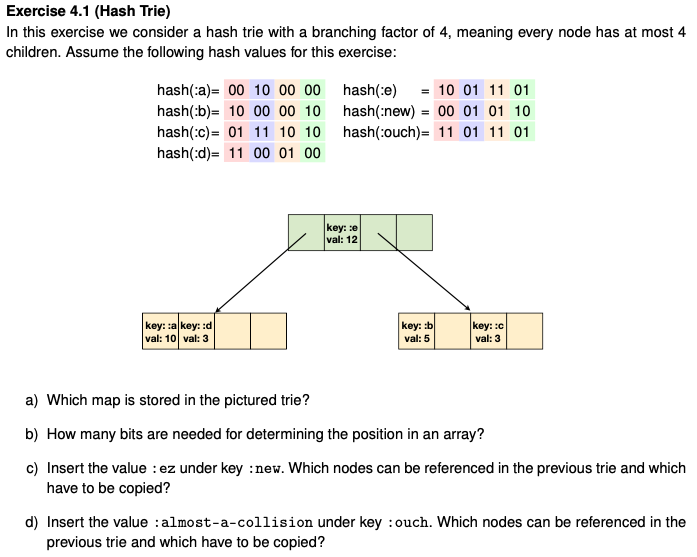

# L4 Trie exercises

  a) `
	{
		:a --> 10,
		:d --> 5,
		:c --> 3,
		:d --> 3,
		:e --> 12
	}`
  b) 2 bits, as $2^2=4$.
  c) The right part of the Trie has to be copied (incl. root). `:new` will be in the second position in the array.
  d) The key `:e` and `:ouch` have the same prefix (or rather postfix), up to the highest two bits. Meaning they will keep propagating through the Trie all the way to the fourth level, where they will be in positions 3 and 4 of the array. Only the root has to be copied.
